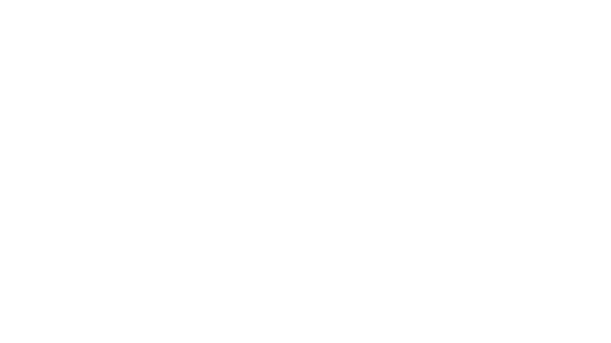
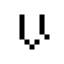
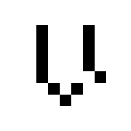
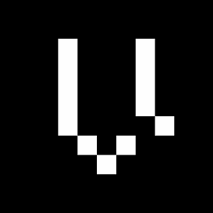

# Brand Icon
| Icon|
| --- |
||
||

If you're looking for the Logotype, you should be in [1A Logotype](../1A-Logotype).    

# Pre-rendered icons
These are handy pre-rendered static images that you can use.

|Smaller|Bigger|Bigger still|
|:---:|:---:|:---:|
|||
|||
|||
|||