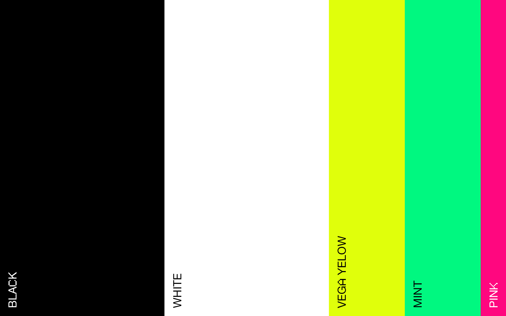

# Colour Palette

| Black  | White  | Yellow  | Mint  | Pink  |
|:---:|:---:|:---:|:---:|:---:|
|   |     |     |     |     |
| `#00000`  | `#FFFFFF`  | `#DFFF0B`  | `#00F780`  | `#FF077F`  |
| `rgb(0,0,0)`  | `rgb(255,255,255)`  | `rgb(223,255,11)`  | `rgb(0,246,127)`  | `rgb(255,7,127)`  |
| `rgba(0,0,0,1)`  | `rgba(255,255,255,1)`  | `rgba(223,255,11,1)`  | `rgba(0,246,127,1)`  | `rgba(255,7,127,1)`  |

## Colour overview

## Colour ratio
Now you know the colours, here's a guide to how frequently to use them. In short, most things should be black and white, with pink appearing very rarely. Green and yellow are available to provide contrast, but should not generally be used for large areas. 

