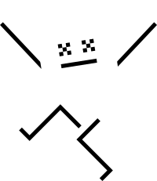
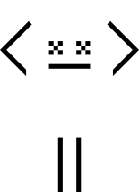
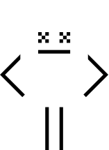

# How to Vega 

Here you'll find the building blocks of the Vega design and branding. Colour references and how to use them, which fonts to use, and so on.
## Logos and icons
| [Logotype](1A-Logotype) | [Icons](1B-Brand-Icon) |
| --- | --- |
||||

## [Colours](./1C-Colour-Palette/)

## [Typefaces](./1D-Typefaces/)

## [Patterns](./1E-Patterns-+-Textures/)
| [Static](1E-Patterns-%2B-Textures/Noise-Pattern) | [Noise](1E-Patterns-%2B-Textures/Noise-Pattern) |
| --- | --- |
|||

## Characters
Occasionally you'll want to add some personality to what you're making. We have some characters you can use.
### [The ghosts of centralised liquidity](./1F-Vector-Graphics/Ghosts-Of-Centralised-Liquidity/)
You can sprinkle some ghosts around. Feel free to make your own poses and submit a pull request!
|   |   |   |   |  |
| :------------: | :------------: | :------------: | :------------: |    :------------: |
|   |   |   |   |  |
|||||
|   |   |   |   |  |
|||||||

### [Hixel](./1G-Hixel/)
Sometimes you need a hedgehog.

