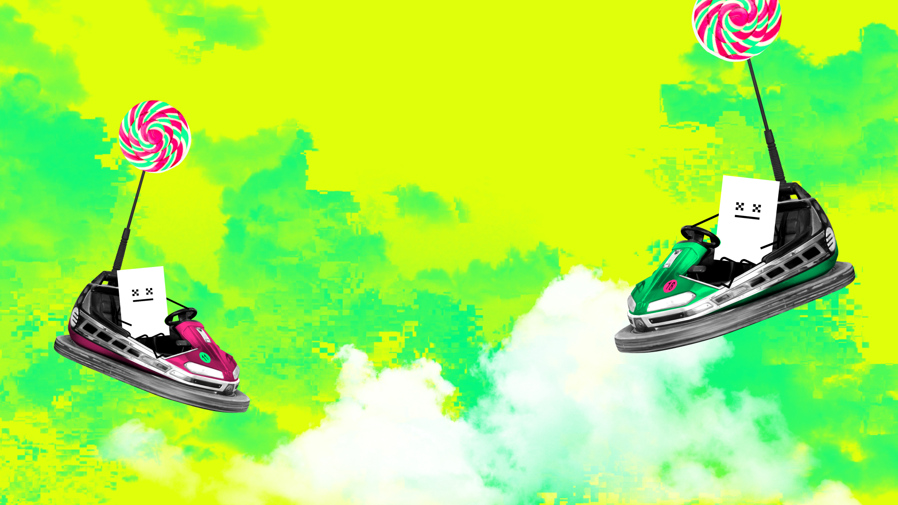
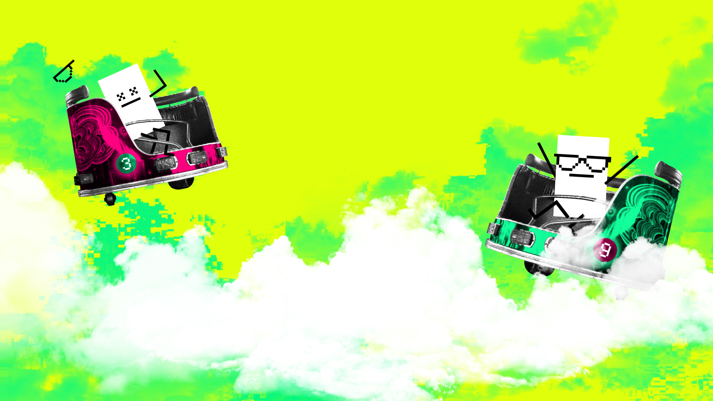

# Video conferencing backgrounds
Now you can make calls as if you were *at* a Fairground. With [ghosts](../3C-Graphics/Ghosts-Of-Centralised-Liquidity/).

## Dodgems

## Line up

## Peek 

## Roll up

# Waltzer

You can make your own with [distorted clouds](../3C-Graphics/Distorted-Clouds/), [fluffy clouds](../3C-Graphics/Fluffy-Clouds/) and the [fairground ghosts](../3C-Graphics/Ghosts-Of-Centralised-Liquidity/). Follow the [brand basic colour palette](../../1-Vega-Brand-Basics/1C-Colour-Palette/), and use the [brand basic typefaces](../../1-Vega-Brand-Basics/1D-Typefaces/).

# ETH Denver Backgrounds
Can't make it to ETHDenver? *Join us* in spirit with these AWESOME Zoom Backgrounds.

## ETH Denver Main

## ETH Denver Alt

