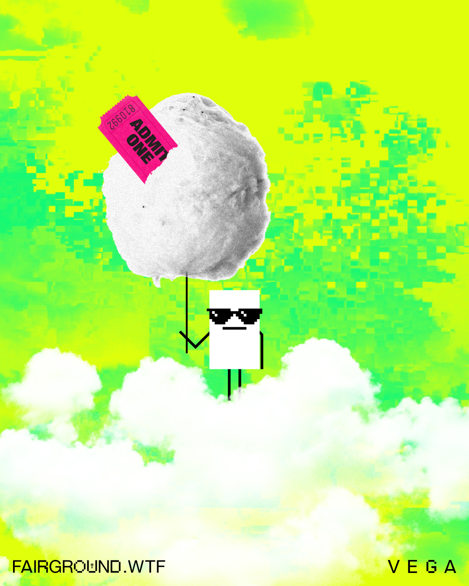

# Visual references

## Reference 1

Also available as a [video conference background](../3D-Zoom-Backgrounds/README.md#Roll_Up).

## Reference 2

## Reference 3

Also available as a [video conference background](../3D-Zoom-Backgrounds/README.md#Waltzers).

## Reference 4

## Reference 5

## Reference 6

You can make your own with [distorted clouds](../3C-Graphics/Distorted-Clouds/), [fluffy clouds](../3C-Graphics/Fluffy-Clouds/) and the [fairground ghosts](../3C-Graphics/Ghosts-Of-Centralised-Liquidity/). Follow the [brand basic colour palette](../../1-Vega-Brand-Basics/1C-Colour-Palette/), and use the [brand basic typefaces](../../1-Vega-Brand-Basics/1D-Typefaces/).
