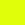
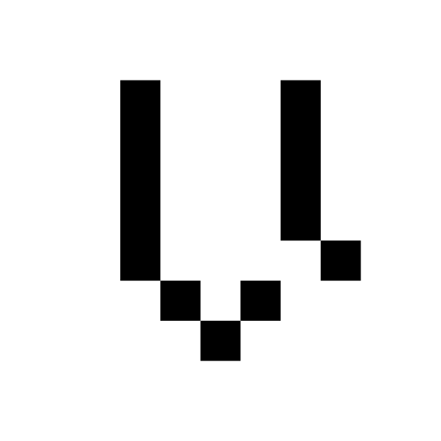

  

<i>Everything you need to make things look Vega-y</i>

# Outline
1. [Brand Basics](./1-Vega-Brand-Basics/) contains logos, typefaces, colours that apply to everything Vega
2. [Vega Console](./2-Vega-Console/) is a user interface for Vega Protocol
3. [Fairground](./3-Vega-Fairground/) is a Vega Testnet

# Quick reference

## [Typefaces](./1-Vega-Brand-Basics/1D-Typefaces/)
- [Helvetica Neue LT Std 55 Roman](https://www.linotype.com/1264118/neue-helvetica-55-roman-product.html)
- [Neue Pixel Grotesk Regular](https://neuepixelgrotesk.com)

## [Colours](./1-Vega-Brand-Basics/1C-Colour-Palette/)
| Black  | White  | Yellow  | Mint  | Pink  |
|:---:|:---:|:---:|:---:|:---:|
|   |     |     |     |     |
| `#00000`  | `#FFFFFF`  | `#DFFF0B`  | `#00F780`  | `#FF077F`  |
| `rgb(0,0,0)`  | `rgb(255,255,255)`  | `rgb(223,255,11)`  | `rgb(0,246,127)`  | `rgb(255,7,127)`  |
|   |     |     |     |     |

## Icons, Logos, Logotypes
| [Logotype](./1-Vega-Brand-Basics/1A-Logotype/)  | [Icon](./1-Vega-Brand-Basics/1B-Brand-Icon/)  |
|:---:|:---:|
||

### Icon variations

|  | | | | |
|:---:|:---:|:---:|:---:|:---:|
|||||

More sizes are available from the [Brand Icon section](./1-Vega-Brand-Basics/1B-Brand-Icon/).

# Credits
The design work in this repository is the work of [Big Fan](https://big.fan/).

  

